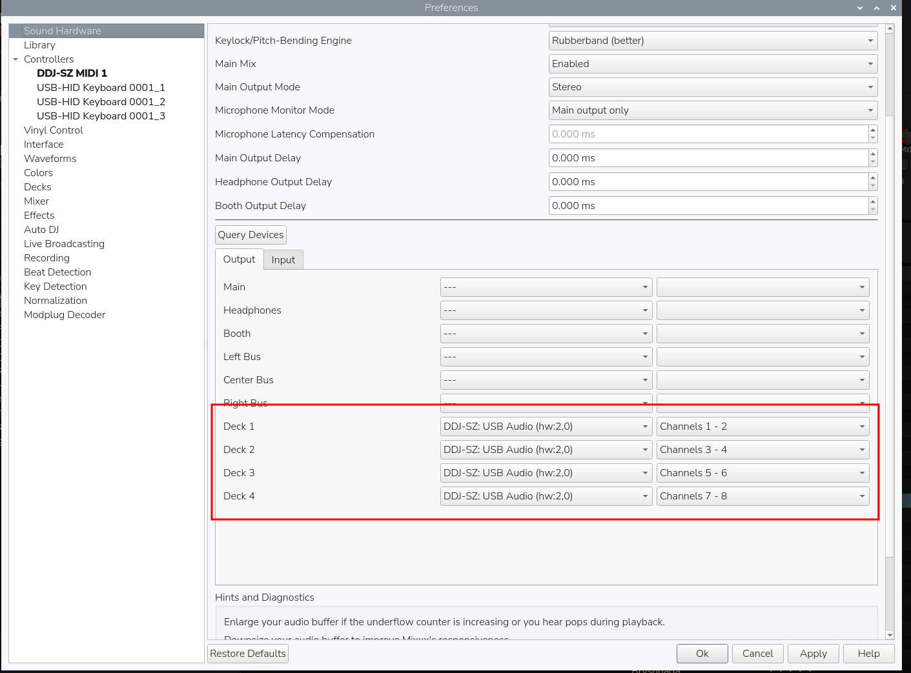
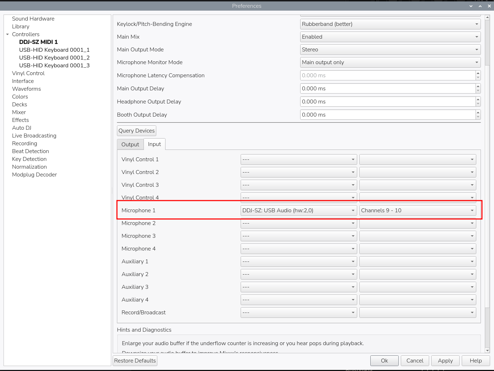
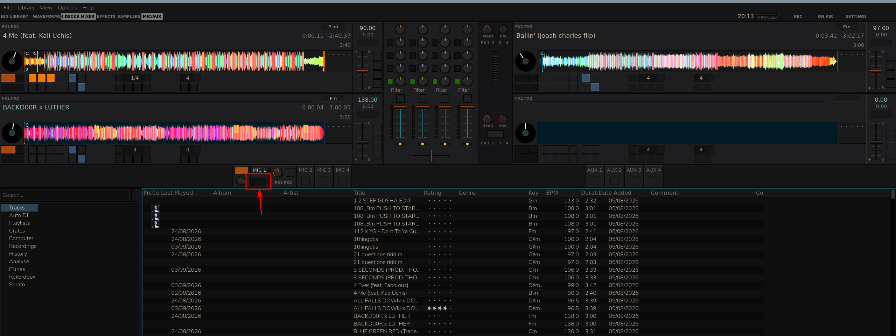

# TLDR
Makes the Pioneer DDJ-SZ work on Linux (audio + Mixxx). Pioneer never
supported Linux, and has now [end-of-lifed the DDJ-SZ entirely](https://downloads.support.alphatheta.com/documents/Support/Discontinuation_of_certain_supportservices_2026_en.pdf)
— no more drivers, no more firmware, no OS guarantees.

Full story, reverse-engineering details, and debugging logs:
[`docs/DDJ-SZ-WRITEUP.md`](docs/DDJ-SZ-WRITEUP.md) ·
[`docs/CUE-INVESTIGATION.md`](docs/CUE-INVESTIGATION.md)

## Install

### Raspberry Pi OS — one command

```bash
git clone https://github.com/hailthekid/ddj-sz-linux-audio.git
cd ddj-sz-linux-audio
./install.sh
```
This does everything below for you: finds the exact kernel source matching
your running kernel, patches it, builds just the affected module, and
installs it. **Read the script before running it** — it needs `sudo`.
Re-run it after every kernel update.

### Other Linux distros — manual

Every distro packages kernel source differently. Debian/Ubuntu example:
```bash
sudo apt install linux-source
cd /usr/src && sudo tar xf linux-source-*.tar.xz
cd linux-source-*/
```
Other distros: search "<distro> kernel source" — must match `uname -r`
exactly, or skip this and use the Raspberry Pi script above.

From inside that source directory, run:

```bash
git apply /path/to/ddj-sz-linux-audio/patches/0001-ALSA-usb-audio-add-Pioneer-DJ-DDJ-SZ-support.patch
ARCH=<your arch> LOCALVERSION= make modules_prepare
ARCH=<your arch> LOCALVERSION= make M=sound/usb
sudo cp sound/usb/snd-usb-audio.ko /lib/modules/$(uname -r)/kernel/sound/usb/
sudo depmod -a && sudo modprobe -r snd_usb_audio && sudo modprobe snd_usb_audio
```

Then verify: `modinfo -F vermagic sound/usb/snd-usb-audio.ko` must exactly
match `uname -r`, or it won't load. See [Troubleshooting](#troubleshooting)
if it doesn't.

### Everyone — check it worked

```bash
aplay -l ; arecord -l                                   # look for DDJSZ
speaker-test -D hw:X,0 -c 10 -r 44100 -F S24_3LE -l 1    # X = card number
arecord -D hw:X,0 -c 10 -f S24_3LE -r 44100 test.wav     # talk into the mic
```

## Channel map

| Playback (host → device) | Feeds |
|---|---|
| ch 1-2 / 3-4 / 5-6 / 7-8 | Channel strips 1-4 |
| ch 9-10 | Booth output |

| Capture (device → host) | Carries |
|---|---|
| ch 9-10 | Mic |
| ch 1-8 | not yet identified |

The DDJ-SZ mixes in analog hardware, not in software — whatever you send
on ch 1-8 must **not** already have fader/EQ/crossfader applied, or it's
applied twice. Master isn't a USB channel at all. Details:
[channel map background](docs/DDJ-SZ-WRITEUP.md).

## Using it with Mixxx

Mixxx's default output type applies its own volume/crossfader before
sending — double-processing the signal and breaking headphone Cue.
[`mixxx/`](mixxx/) has a mapping that fixes this: copy both files to
`~/.mixxx/controllers/`, select **Pioneer DDJ-SZ (hardware mixer)** in
Preferences → Controllers, and match this Sound Hardware setup:

**Output** — four Deck outputs, nothing on Main/Headphones/Booth:



**Input** — Microphone 1 on channels 9-10:



Getting the channels right isn't enough on its own to record the mic —
Talkover has to be enabled too (View → Show Microphone Section), or the
mic never reaches the main mix:



Why, and how it was found: [`docs/CUE-INVESTIGATION.md`](docs/CUE-INVESTIGATION.md).

## Troubleshooting

**Module won't load.** `modinfo -F vermagic` must exactly match `uname -r`.
Usually a kernel-source mismatch or a stray `CONFIG_LOCALVERSION`/`+dirty`
suffix — `install.sh` checks this automatically.

**Capture is exact silence, not just quiet.** The DDJ-SZ needs a vendor
"arm" sequence before capture works (`ddj_sz_arm_quirk()` in `quirks.c`,
already in the patch). If you're still seeing zeros, check `dmesg` to
confirm the patched module actually loaded.

More: [`docs/DDJ-SZ-WRITEUP.md`](docs/DDJ-SZ-WRITEUP.md).

## Upstream

Patch is submitted to the Linux kernel's ALSA maintainers — once merged,
no install step needed for anyone, ever. Status: [`docs/UPSTREAM.md`](docs/UPSTREAM.md).

## License

GPL-2.0 — see [`LICENSE`](LICENSE).
